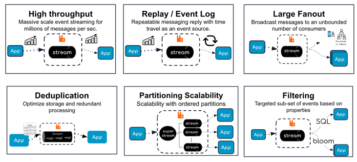
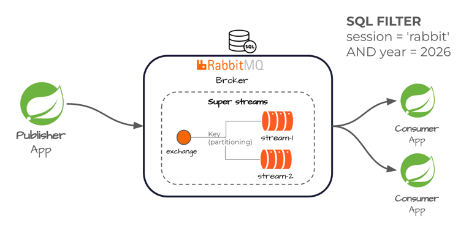

# spring-rabbit-office-hours

This repo focuses on demonstrating RabbitMQ streaming capabilities for spring applications.

The following are related publications of the material demonstrated

- [Spring for Rabbit Super Stream and SQL filters](https://www.youtube.com/watch?v=lbhGFw1GKQ0&vl=en-US) Spring I/O (2026) 

The following are the high level RabbitMQ streams use cases.

Example Reference Architecture

